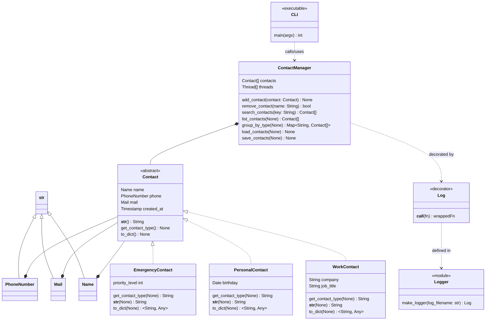

```mermaid
classDiagram
class PhoneNumber
class Mail
class Name
class str
class CLI {
	<<executable>>
	main(argv) int
}
class Contact {
	Name		name
	PhoneNumber	phone
	Mail		mail
	Timestamp	created_at
	__str__() String
	<<abstract>>
	get_contact_type() None
	<<abstract>>
	to_dict() None
}
class ContactManager {
	Contact[] contacts
	Thread[] threads
	add_contact(contact: Contact) None
	remove_contact(name: String) bool
	search_contacts(key: String) Contact[]
	list_contacts(None) Contact[]
	group_by_type(None) Map~String, Contact[]~
	load_contacts(None) None
	save_contacts(None) None
}
class EmergencyContact {
	priority_level int
	get_contact_type(None) String
	__str__(None) String
	to_dict(None) ~String, Any~
}
class PersonalContact {
	Date	birthday
	get_contact_type(None) String
	__str__(None) String
	to_dict(None) ~String, Any~
}
class Logger {
	<<module>>
	make_logger(log_filename: str) Log
}
class Log {
	<<decorator>>
	__call__(fn) wrappedFn
}
class WorkContact {
	String	company
	String	job_title
	get_contact_type(None) String
	__str__(None) String
	to_dict(None) ~String, Any~	
}

str <|-- PhoneNumber
str <|-- Mail
str <|-- Name
Contact --* PhoneNumber
Contact --* Mail
Contact --* Name
ContactManager *-- Contact
ContactManager ..> Log : decorated by
Log ..> Logger : defined in
Contact <|.. EmergencyContact
Contact <|.. PersonalContact
Contact <|.. WorkContact
CLI ..> ContactManager: calls/uses
```