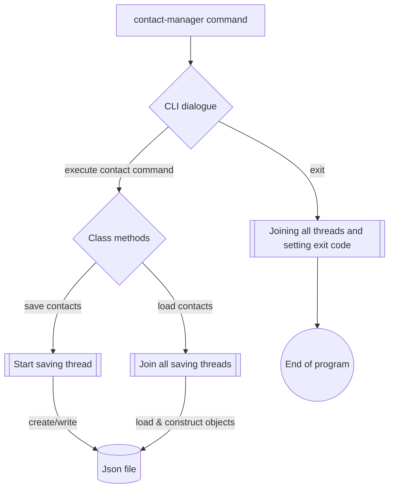

```mermaid
flowchart TD
CMD[contact-manager command] --> CLI
CLI{CLI dialogue} -->|execute contact command| METH{Class methods}
CLI -->|exit| CLEAN[[Joining all threads and setting exit code]]
METH -->|save contacts| THREAD[[Start saving thread]]
CLEAN --> END((End of program))
THREAD -->|create/write| FILE[(Json file)]
METH -->|load contacts| JOIN[[Join all saving threads]]
JOIN -->|load & construct objects| FILE
```